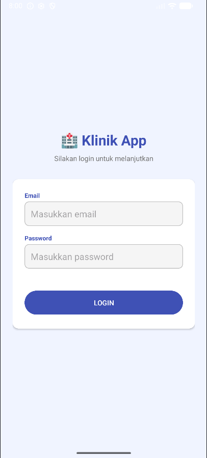
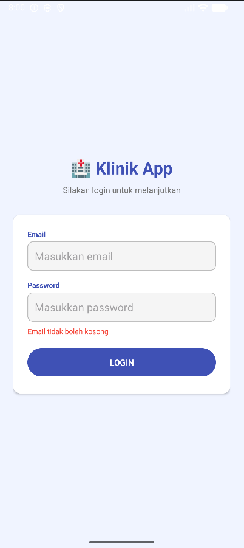
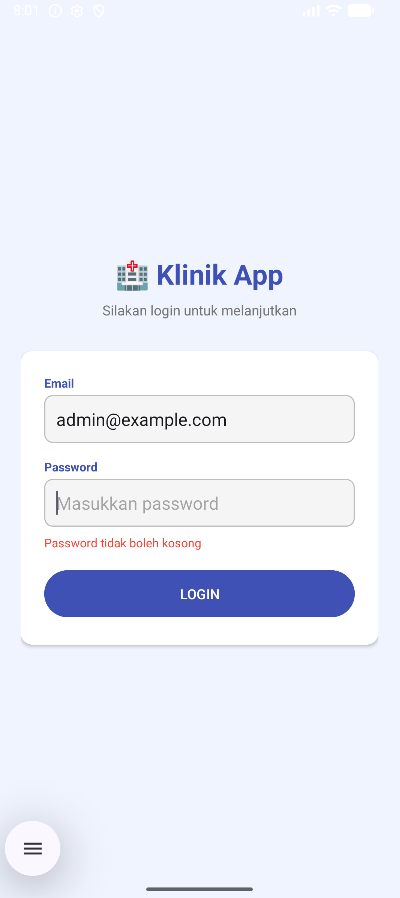
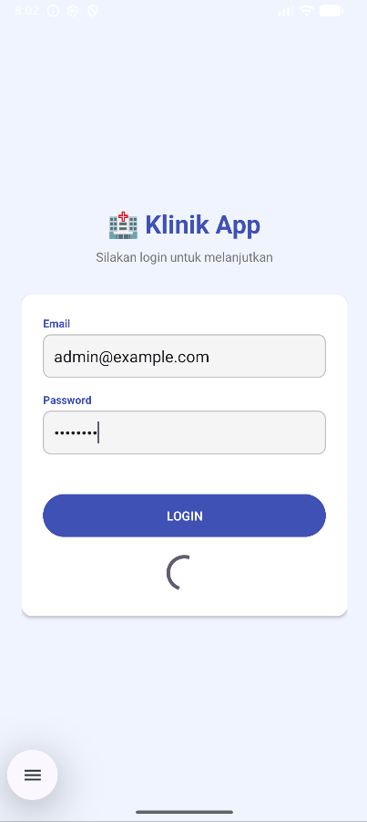
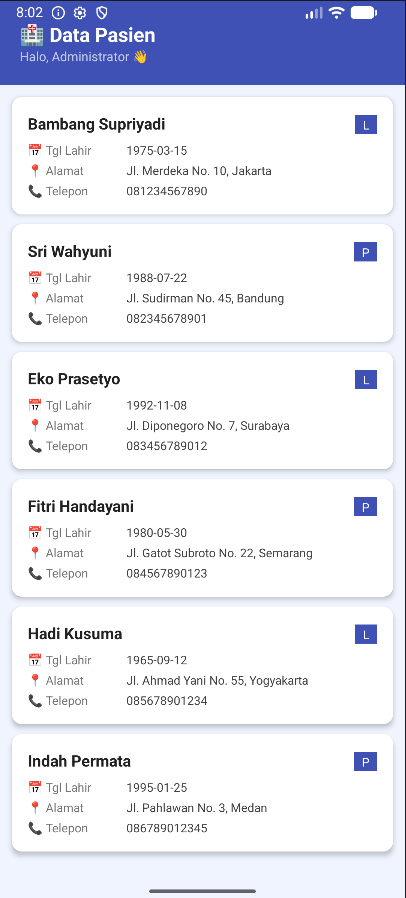

# 🏥 Aplikasi Login dan Data Pasien

## Identitas Mahasiswa

| Field        | Keterangan              |
|--------------|-------------------------|
| Nama         | [Valerine Jesika Dewi]  |
| NIM          | [F1D02310027]           |
| Kelas        | [Mobile C]              |

---

## Deskripsi Project

Aplikasi Android berbasis Kotlin yang mengimplementasikan autentikasi login menggunakan REST API. Setelah login berhasil, aplikasi menampilkan daftar data pasien yang diambil dari endpoint API menggunakan Bearer token. Aplikasi dibangun menggunakan Retrofit untuk HTTP client dan RecyclerView untuk menampilkan daftar pasien.

---

## Fitur Aplikasi

- ✅ Login menggunakan email dan password via REST API
- ✅ Validasi input kosong pada form login
- ✅ Menyimpan token dari response login menggunakan SharedPreferences
- ✅ Menampilkan nama user setelah login berhasil
- ✅ Mengambil data pasien dengan header Authorization Bearer token
- ✅ Menampilkan daftar pasien menggunakan RecyclerView
- ✅ Setiap item pasien menampilkan nama, tanggal lahir, jenis kelamin, 
     alamat, dan nomor telepon
- ✅ Indikator loading saat request berjalan
- ✅ Pesan error jika request gagal

---

## Screenshot

### Halaman Login

### Valisasi Input Kosong

### Indikator Loading

### Halaman Data Pasien

